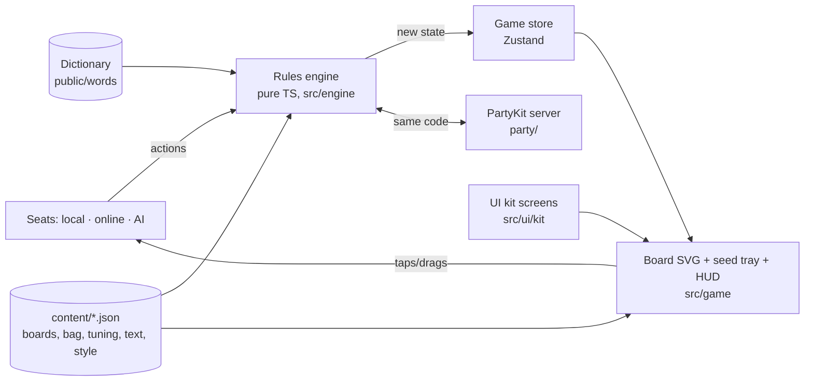

# Glyphtender — Technical Design Document (TDD)

> How the game is built. Plain English first; code names in `backticks` only where they help.
> Living document — /define writes it, /develop keeps it true, /tdd shows it.
> Last updated: 2026-09-30 (sprint 06 — feel pass: word indicators, score pops, drop target, turn pulse, "no" shake, layout)

## 1. At a glance
- **Platforms:** web — phone browsers (portrait + landscape) and desktop. Installable PWA.
- **Stack:** Vite + TypeScript + React, **2D SVG board (no Three.js)**, Zustand for screen state. Why: a flat hex board wants crisp, resizable, tappable shapes — SVG gives that for free, runs cool on phones, and every hex is a real element we can highlight and test.
- **Where it runs online:** GitHub Pages (game) + PartyKit on Cloudflare (online rooms, from alpha's online milestone). Built in sprint 05 and run **locally only** so far: `npm run party:dev` (PartyKit dev server on **port 1997** — `partykit.json`; Roll Better uses 1999) + `npm run dev`; `partykit` (dev dependency) + `partysocket` (the client's reconnecting WebSocket). Going live (`npm run party:deploy`) is Muzzy's call (/deliver).
- **Framework modules:** Game UI kit 0.2.5 (Cozy, night colours; 0.2.5 = Button `size`) · Dev Kit · **rooms** 0.1.0 (online, `src/rooms/`; harvested from Roll Better during this game) · **ai** (beta; first AI module, built from the original's goal-selection model).
- **Dev Kit tools used:** Console, Tuning, Color, **Snapshots** + **Bug capture** (kit 0.3.0, framework-first — F16/F17): the game plugs in through `src/devkit-game/glyphtenderAdapter.ts` (state = engine GameState + tray order; events = a line per placement/turn/refresh/phase/tangle/note); snapshots live in `content/snapshots/`, captures in `.planning/bugs/`. Later: Multiplayer (online milestone), AI (beta).

## 2. How it fits together

- **Rules engine** (`src/engine/`) — the whole game as pure functions: `applyAction(state, action, words) → state` (the word list is passed in — too big to live in the state) plus `checkAction` (why an action is illegal, or null), `legalDraftHexes`, `legalMoves`, `legalCasts`, `previewTurn` (words + Magic for the Cast button), `findWords`, `tangledIds`. No React, no screen, no network. Seeded random (bag order, refresh put-backs; the generator's position lives in the state) so a game can be replayed from its seed + action list.
- **Seats** (`src/store/seats.ts`, sprint 04) — who is in each chair: `{ kind: 'local' | 'online' | 'ai', name, colour }`. A local seat sends actions from taps; an online seat will receive them from the server; an AI seat (beta) will compute them. The engine doesn't know which. The store asks one question before any tap does anything — `canPlay()`: a game, no seed in the air, no handoff waiting, and the current seat is a **local human on this device**. Online/AI seats plug in there. `needsHandoff(seats, from, to, hideSeeds)` = two different local humans and seeds hidden.
- **Game store** (`src/store/gameStore.ts`, Zustand; plain helpers in `turnPlan.ts`) — the engine's state, the word list (fetched once), the planned move + cast and what's held (undo = drop the plan), refresh set-aside, each seat's tray order, and `flying` (input locked while a seed is in the air). Its actions only change the game by sending an engine action (checkAction first). Sprint 04 added: `seats`, `options` (the table options — Play again reuses them), `handoff` (`{ seat, afterGrow }` while the device is being passed on — the tray is hidden and every tap is ignored until `showSeeds`), `stats` (end table: best turn, longest word, words made — `stats.ts`, gathered from each turn's `lastTurn`), `revealAt` (how far the Magic reveal has got) + `skipReveal`.
- **View** (`src/game/`, built in sprint 03) — `GameScreen` (layout shell), `Board` (SVG hexes, pieces, highlights, word outlines, grown glow), `useThrow` (the Cast story), `SeedTray` (SVG), `trayLayout` (real-size maths), `TurnBar`, `ActionBar`, `GameOver`, `usePieceInput` (tap-tap and drag share one Pointer Events hook, on the whole screen), `prompt`, `usePreview`, `useTuning`, `art`, `devHook` (dev only). Sprint 04: `Handoff` ("Pass to Blue"), `DangerCue` (thorny ring / vine), `Reveal` (the players' Magic chips in the tray's place + the reveal clock), `RevealMarks` (tangled glow + "+3" pops on the board), `GameOver` (the end table). Menus: `src/ui/NewGameScreen.tsx` + `newGame.ts` (choices remembered in localStorage), `menus.tsx` (Pause → Rules). Sprint 06 (feel pass): `WordBorders` (white word border behind the seeds), `ScorePops` (each seed's Magic → the turn's total over the caster), `PromptLine` (the prompt, just above the tray — `TurnBar` is now portrait + Menu), `dropTarget` ("drop here" while dragging), `useTurnPulse`, `useNopeShake`, `feel` (juice tiers from feel.json), `boardPlace` (the board sits close to the tray); plain logic in `src/store/wordMarks.ts` (pops + border hexes), `turnPulse.ts`, `nope.ts`; `src/ui/gameSettings.ts` (the game's own Settings rows — Tray position).
- **Layout shell** (`src/game/GameScreen.tsx` + `game.css`) — chooses **stacked** (tall) or **side tray** (wide) from the *shape of the free space* (aspect ≥ 1.15 → stacked), not the device. Board SVG auto-fits its box; zoom (optional, with a Fit button) not built yet. Side layout: the right column is the tray's width (sidePanelShare × width). Sizes in `content/tuning/layout.json`.
- **Menus/HUD** — UI kit screens only (MainMenu, Settings, Pause, HowToPlay = Rules, the new-game screen and end table built from kit Screen/Panel/ListRow/Stepper/Selector/Toggle, PlayerChip for the reveal, toasts). Board, tray and pieces are game components styled only with kit tokens.
- **Online** (`party/`, sprint 05) — `server.ts` is the rooms module's `RoomServer` with Glyphtender's plug-in `glyphtenderRules.ts`; it runs the *same engine*; the server is the only one who knows the bag, the rng and every hand (`serverGame.ts`); each player is sent **their own view** (`views.ts`: own seeds, others' as '?', no Magic until the end). On the device: `src/store/onlinePlay.ts` (views in, replays, my actions out) and `src/ui/online/` (session, join/create, lobby, the live connection).

**Golden rules**
- The engine never touches the screen or network; the screen never changes game state except by sending an action.
- One engine for client, server, AI and tests — rules are never re-written anywhere else.
- Hidden information stays hidden in the data, not just the display: online views never contain other hands or Magic totals.
- Every tweakable value lives in `content/` — board shapes, bag, hand size, bonuses, timings, layout sizes, colours.
- Every fixed bug gets a test that guards it; every rule in GDD §4 has at least one test.

## 2b. Game-specific systems
**Coordinates** — engine uses **axial hex coordinates** (q, r) — the standard (Red Blob Games) — so leylines are simple steps. Boards are defined in `content/data/boards.json` as column heights (`[4,7,8,9,10,9,10,9,8,7,4]`) like Muzzy's paper notation, converted at load. Designer notation `C4-3` shown in Dev Kit / bug reports.
**Rules engine files** (`src/engine/`, built in sprint 02) — `types.ts` (GameState is plain JSON-able data: phase draft/play/refresh/over, current seat, snake order, glyphlings `{id, seat, hex}` with id = seat×2+0/1, seeds by hexKey, hands, bag (draw from the front), Magic, tangled ids, lastTurn, tangle bonus, winners, rng) · `setup.ts` (bag + snake order) · `draft.ts` · `moves.ts` · `turn.ts` (move + cast + Magic + draw) · `refresh.ts` · `wordFinder.ts` · `words.ts` (list loader) · `tangle.ts` (tangles, end, bonus, winners) · `engine.ts` (the one door: `applyAction`) · `sim.ts` (random/greedy players + invariants; `npm run sim`) · `testkit.ts` (hand-made positions by designer label). Actions: `{type:'draft', hex}` · `{type:'turn', glyphling, to, seed: hand index | null, target}` · `{type:'refresh', setAside: hand indexes}`. Illegal actions **throw** an Error with a plain-English reason. Rule numbers are copied from `content/tuning/rules.json` into `state.config.rules` at new game, so replays and online games keep the numbers they started with.
**Words** — per leyline, collect the run of letters through the new seed; check every sub-run of ≥ min length containing the new seed; keep valid words; drop any word covered by the union of the other kept words on that line (GARDENING/DEN, SEAL+LEAP/ALE). Tested against every example in the digest.
**Piece states + the throw** (from the F01 prototype) — every piece shows one of: options (glow + dot) · held (solid ring, player colour) · planned (pulsing halo at the hex edge, player colour; targeted seed faded) · done. The halo sits *outside* the art's own coloured frame. Cast plays: glyphling hop → seed flies a bezier arc (time = `flightBase` + `flightPerHex` × distance) → runeblossom sprouts with overshoot; the game state commits on landing; input is locked in flight. Frames mutate SVG attributes directly (no React state per frame): the flight is a requestAnimationFrame loop on a ref, the hop / sprout / grown-word glow use the Web Animations API, the planned halo pulses with an SVG `<animate>`. After landing the words that grew glow in the player's colour and fade (`wordGlowTime`). Reduce motion → no flight, the turn commits at once. **Move glide** (F15, `glide.ts` + `useGlide.ts`): whenever a glyphling is drawn on a different hex than last render it slides there (Web Animations on its `[data-glide]` group, ease-in-out + a tiny `moveSettle` bounce; time = `moveBase` + `movePerHex` × hexes) — it only knows "was on A, now on B", so a planned move, Undo / the ghost, the dev hook and (online) other players' committed moves all glide the same way; a new change mid-glide starts from where it is on screen; it never locks input; reduce motion = instant. Numbers: `content/tuning/anim.json`, colours: `garden.json`.
**Feel pass** (sprint 06, GDD §4 "Muzzy's feel notes") —
- **Word indicators** (a table option: new-game screen, remembered; online the host's lobby option, sent in every view's `options`). On: planned words (while aiming) and grown words (after landing) share ONE look — a white ring (`wordBorder`, `wordBorderWidth`) centred on each word hex's edge and drawn UNDER the seed art, so it frames the letters like a border; the grown one fades (`wordGlowTime`). Off: no border, "Cast" without "+N", no score pops.
- **Score pops** (`wordMarks.scorePops`, tested): per word, per seed, the engine's `seedMagic` (1 + ownershipBonus for the caster's own seed — `magicFor` adds exactly these up); ripple word by word → all fly to the casting glyphling (`lastTurn.to`) → one "+N" swells, lingers, fades. Computed on the device from the board (words + seed owners are public; online views still zero every Magic). Pass-and-play: the handoff box waits for them; the end reveal too (`landingSeconds`). Reduce motion: only the total. Never smaller than `scorePopMinPx` on screen.
- **Cast range** shows as soon as the move is planned (gold, before a seed is picked); an aimed seed re-aims by tapping another gold hex.
- **Drop target**: while dragging, the legal hex under the floating piece fills bright + a glow ring spills past it (the piece covers the hex); an illegal hex shows nothing (`turnPlan.dropKind`).
- **Turn pulse** (`turnPulse.pulsingGlyphlings`): the current local human's glyphlings that can move breathe (feel.json small tier, `turnPulseTime`) until a move is planned; never in the draft or a refresh, never the held or a tangled one; online only on your turn.
- **"No" shake** (`nope.nopeFor`): another player's glyphling, a tangled one, any glyphling outside your move step, a planted seed, a tray seed TAPPED before moving (a drag reorders), anything of yours when it isn't your turn online → a quick sideways shake of that piece (feel.json small tier × its width, `noShakeTime`). Quiet: seed in the air, handoff, waiting for the server, game over, empty hexes.
- **Layout**: action buttons are a board hex tall (hex width × √3/2, ≥ 44; kit Button `size`); the prompt sits just above the tray (heading size; title size when hexes ≥ 64 px); the board sits close to the tray (`boardPlace.boardShift`: tall = right on it; wide = 1/8 of the spare room on the tray's side). Settings → Gameplay → **Tray position** Standard / Flipped (tall: tray above; wide: tray left), followed live; the side column keeps the ruler's width either way.
- Every one of these animates with Web Animations on SVG elements (no React state per frame) and reads timings/sizes from content/.

**Tray** — seeds are **real size: tray seed = the board's on-screen hex width, never below `trayTileMin` (44 px)**; one row of 8 if that fits, else 2 rows of 4 rather than shrinking; only if 4 still don't fit do they shrink to fit (never below 44). Maths in `src/game/trayLayout.ts` (tested). Measured (Small board, e2e): phone tall hex 42 → seed 44 (2×4) · phone wide 41 → 44 (2×4) · desktop 96 → 96 (2×4). Tray order is the screen's own (store), kept across turns; reorder by dragging within the tray; Shuffle.
**Pass-and-play** (sprint 04) — the store decides when the device is passed: after the draft (before turn 1) and whenever play passes to another local human, **after** any refresh (the player who just played refreshes first). `Handoff.tsx` shows a kit Screen dialog (the garden dimmed but visible) with the next player's portrait, "Pass to Blue" and a "Show my seeds" button in their colour; it waits for the throw's sprout, word border and score pops (`landingSeconds`) so everyone watches the move. It is NOT on the kit screen stack, so Esc / phone Back can't reveal the seeds by accident. Hide seeds off → never shown.
**Tangle danger** (`src/store/danger.ts`) — from the committed board with the engine's `legalMoves`: 1 move = warning (dashed "thorny" ring, owner's colour), 0 = tangled (a curly vine + leaves, the glyphling fades). Everyone's glyphlings; never during the draft; a held/planned glyphling shows its own ring instead.
**The Magic reveal** (`src/store/revealPlan.ts`, pure + tested) — a list of steps from the finished game: tangles pulse → one bonus step per rival piece next to a tangled glyphling ("+3", same sum as the engine's tangle bonus) → one count step per player, lowest Magic first → winner. `revealAt` walks through them on timers (anim.json); Skip jumps to the end; reduce motion starts at the end; the end table opens when it finishes. Magic stays "?" on every chip until that player's count.
**Dictionary — the official Glyphtender word list** is the original's `words.txt`, **copied byte-for-byte** (blob `3280512a`, identical on the original's main and festive-booth): 63,657 words (63,656 line breaks — the last word, ROMAN, has none after it; Zipf ≥5/4/3/2 = 1,000 / 6,342 / 21,805 / 43,997), 2–15 letters, each with a **Zipf score** (how common it is: THE 7.73 … rare words 0). How it was made: Muzzy chose TWL in the Python prototype (2025-12-14) → 63,612-word list (2025-12-17) → cleaned: abbreviations out, scoring fixes (12-21) → +218 missing words incl. 2-letter words (12-22) → roman numerals out + Zipf column added for AI difficulty (12-23). **Never edit it by hand in code** — it lives in `public/words/words.csv` (marked binary in `.gitattributes`; a test checks its SHA-256); changes are deliberate, logged commits. The game uses the words; the **AI uses the Zipf scores** (difficulty + personality vocabulary). Loaded once, async, into a `Map<word, zipf>`; ~250 KB gzipped.
**Multiplayer** (alpha, built in sprint 05) — server-authoritative, same engine. Design: [design/online.md](design/online.md). How it was built:
- **Room** = the rooms module (`src/rooms/`, framework 0.1.0): codes, join/rejoin by persistentId, host + migration, ready/start, a bot takes a dropped/left/idle seat, empty-room clean-up; its own messages (`join`, `ready`, `start`, `leave`, `back_to_lobby`, `action` → `room`, `view`, `error`, `closed`).
- **Glyphtender's messages** ride inside it (`party/protocol.ts`): player → `{ kind: 'play', action, version }` or `{ kind: 'sync' }`; server → a `GameView` `{ gameId, version, mySeat, names, change, by, game, turnEndsAt, results }`. `game` is GameState-shaped (the store, board, previews and danger cues work unchanged): other hands and the bag are '?' × count, rng + seed 0, every Magic zeroed until `phase: 'over'`; then `game` is the whole truth and `results.stats` the end table (gathered on the server).
- **Server checks** (`glyphtenderRules.ts`): shape (the rooms checks helpers) → a seat in this game → its turn → `version` = the server's → the engine's `checkAction` → `applyAction`. Every refusal is a plain-English Error; the state is unchanged.
- **The server's own turns** (`turnClock.ts`): a bot seat plays after `botTurnDelayMs`; the turn timer (host option, off by default) plays a turn on expiry and counts a missed turn. Both use the engine's greedy sim player and "keep all" on a refresh.
- **Word list on the server**: bundled as text. esbuild has no .csv loader, so `scripts/server-words.mjs` copies `public/words/words.csv` → `party/words.gen.txt` (gitignored) before every build (`partykit.json` → `build.command`). Server bundle **915 KB minified / 293 KB gzipped** (Workers free limit: 3 MB gzipped).
- **Device**: my seat plans exactly as pass-and-play; Cast posts at once and the throw flies; the view is applied when the seed lands (if it's late, it asks again every 3 s). Other seats' turns replay on the old view (glide → throw after `glideSeconds` → land → new view + sprout), queued in order. No handoff online. A reload goes straight back to the seat (room code in sessionStorage). Party host = `VITE_PARTY_HOST`, else the page's host + partykit.json's port.
- **Screens**: main menu → Play online → name + Create / Join (kit Lobby) → lobby (kit Lobby + the host's options: Garden Auto/Small/Large, 2-letter words, Turn timer, Word indicators) → the game → end table (New game = the host takes everyone to the lobby, where the host starts again; a guest's New game says "Waiting for the host…" · Menu = leave). Sprint 06 removed Play again. Connection lost → the kit's Reconnecting box.
- **Tests**: `party/server.test.ts` (fake PartyKit + the real rooms module: whole games with every view checked for secrets; refusals; timer + bots) · `src/store/onlinePlay.test.ts` (the store against a fake room, incl. a whole game) · `npm run e2e:online` (two browsers + its own partykit dev on 1997 + Vite on 5311; every received WebSocket frame checked for secrets; reload, host drop, rejoin, reveal + end table on both).
**Timers**
| Timer | Length | Owned by | Starts when | On expiry |
|---|---|---|---|---|
| Handoff screen | none (tap to reveal); appears after growTime + wordGlowTime when a seed was thrown | client | turn passes to another local seat (and before turn 1) | — |
| Grow animation | ~0.8 s (`content/tuning/anim.json`) | client | Cast committed | next turn shown |
| Reveal steps | tangles 1.4 s · each +3 0.55 s · each count 1.5 s · winner 2.5 s (≈ 8 s for 2 players), skippable | client | game ends, after the last seed grows | next step; after the last → end table |
| Turn timer (online) | off by default; the host picks 60 / 90 / 120 s (`content/rooms.json` → turnTimerChoices) | server | a seat's turn starts (its refresh is the same turn) | the server plays a legal turn for them (greedy sim player, keep all) + 1 missed turn |
| Idle → bot (online) | 2 missed turns in a row (`missedTurnsBeforeBot`) | server (rooms module) | the first missed turn | a bot takes the seat (alpha: the sim player · beta: an AI personality); a real move takes it back |
| Dropped → bot (online) | 60 s (`botTakesOverAfterMs`) | server (rooms module) | a player's connection drops mid-game | a bot takes the seat; rejoining takes it back |
| Bot turn (online) | 1.5 s (`botTurnDelayMs`) | server | it's a bot seat's turn | the bot plays (so the others can watch it) |
| Waiting for my view (online) | 3 s, repeating | client | my action is sent | ask for the view again (`sync`); a same-version answer = the action was lost → the plan comes back |
| Empty room (online) | 5 min (`keepEmptyRoomMs`) | server (rooms module) | the last player drops mid-game | the room is cleared (an empty lobby clears at once) |
| Rematch (online) | none | — | results shown | the host's New game → everyone to the lobby (sprint 06: no Play again) |
| Score pops | ≈ 2.5–3.5 s: scorePopDelay 0.25 + scorePopGap 0.08/seed + scoreWordGap 0.15/word + scorePopTime 0.3 + scorePopHold 0.4 + scoreFlyTime 0.45 + scoreTotalHold 1 + scoreTotalFade 0.4 | client | a seed that grew words lands (mine, pass-and-play, or another player's replay online) | gone; the handoff box / reveal may cover the garden |
| Turn pulse | loops, turnPulseTime 1.6 s | client | the local player's turn (play phase) | stops when a move is planned |
| "No" shake | noShakeTime 0.35 s | client | a refused tap | — |

## 3. Data the game reads (editable by Muzzy — in Obsidian or the Dev Kit)
| File | What's in it | Edited with |
|---|---|---|
| `content/data/boards.json` | board shapes (column heights), default board per player count | Obsidian |
| `content/data/bag.json` | seed counts per letter (incl. `Qu`) | Obsidian / Dev Kit → Tuning |
| `content/tuning/rules.json` | hand size 8, min word 2, tangle bonus 3, tangles to end 2, ownership bonus 1 | Dev Kit → Tuning |
| `content/tuning/layout.json` | stacked/side threshold, tray seed minimum (44) + gap, side panel share, board margin, drag lift + drag start distance | Dev Kit → Tuning |
| `content/tuning/anim.json` | move glide (moveBase, movePerHex, moveSettle), throw (flight, arc, hop), sprout, halo pulse, grown-word border fade (wordGlowTime 1.4); reveal timings (revealTangles, revealBonus, revealCount, revealWinner, revealPopTime); sprint 06: score pops (scorePopDelay, scorePopGap, scoreWordGap, scorePopTime, scorePopHold, scoreFlyTime, scoreTotalHold, scoreTotalFade), turnPulseTime, noShakeTime | Dev Kit → Tuning |
| `content/tuning/garden.json` | night garden colours (board box background, hexes), 4 player colours, move/cast glow + dropStrength ("drop here"), word border (wordBorder white, wordBorderWidth; grownGlowStrength = its strength right after growing), ghost + faded-seed strength, flying-seed shine; danger cues (warningWidth, warningDash, vine, vineWidth, tangledDim); reveal "+3" (revealPop, revealPopSize); score pops (scorePop, scorePopSize, scoreTotalSize, scorePopMinPx) | Dev Kit → Tuning |
| `content/tuning/feel.json` | game-feel juice tiers small / medium / big (grow = swell past full size, shake = sideways share of a piece's width) and which moment uses which (turnPulse, noShake = small · seedPop = medium · totalPop = big) | Dev Kit → Tuning |
| `content/ui/style.json` | UI kit look: Cozy preset + night colour tweaks (D09) — every menu/HUD colour, shadow, panel texture | Dev Kit → Color |
| `content/ui/settings.json` | Settings screen rows (kit standard list; `"on": false` hides a row — language, account and placeholder links are off for now); the game's own: Gameplay → Tray position (Standard / Flipped) | Obsidian |
| `content/text/en.json` | every player-facing word — menu, new game (`newGame`), turn prompts, notes, buttons, pause, rules (3 pages), handoff, reveal, end table (`game` section) | Obsidian |
| `content/rooms.json` | online rooms: seats 2–4, missed turns before a bot (2), dropped player → bot after (60 s), empty room kept (5 min), bots allowed (no) · Glyphtender: turn timer choices (the first = the default: 0 = off, then 60, 90, 120 s), bot turn delay (1.5 s). The server bundles it: a change needs a server rebuild | Obsidian |
| `content/credits.json` | fonts, word list | organize-assets |

## 4. Standards
- **Folders:** `src/engine` (rules, pure + tests) · `src/store` (incl. seats) · `src/game` (board, tray, layout) · `src/screens` (kit screens wired up) · `src/ui/kit` (installed, never edited) · `src/devkit` (installed) · `src/devkit-game` (our tabs) · `party/` · `content/` · `public/art` · `sketches/` (prototypes — throwaway) · `e2e/`.
- **Naming:** game words in code match the GDD: `glyphling`, `seed`, `cast`, `magic`, `tangled`, `leyline`. Files `PascalCase.tsx` for components, `camelCase.ts` for logic; JSON keys camelCase.
- **Readable code:** plain names, small files (< ~300 lines), a one-line comment on anything non-obvious. No clever tricks.
- **Tests:** vitest for the engine (every rule, every original bug as a guard) and store; e2e (Playwright, bundled Chromium only) for a scripted full game at 390×844, 844×390, 1440×900. Feel is judged by Muzzy, not tests.
- **Same build everywhere:** CI runs `npm test` + `npm run build` (type check included) before deploying.
- **Branches:** one work branch per delivery (`dev/<milestone>`), merged by /deliver. Tiny fixes on main.
- **Prototypes** live in `sketches/`, reachable at `/glyphtender/sketches/<name>`; their code is not reused unless it's clean — the learnings go into the GDD/TDD.

## 5. Budgets
| | Target | How it's checked |
|---|---|---|
| Frame rate | 60 fps on a mid-range phone during grow animations | Dev Kit → Perf (when built) / DevTools |
| First load | < 3 s on 4G; download < 2 MB incl. dictionary + stand-in art | /deliver quick check |
| Art | runeblossoms + glyphlings ≤ 256 px WebP (originals are 2000 px) | organize-assets |
| AI turn (beta) | < 1 s on a phone, in a Web Worker | timing test |
| Network | 1 action + N views per turn; PartyKit free tier | server logs |

## 6. Security & fairness
- Online: clients only send *intentions*; the server's engine decides. Clients never receive other hands, the bag order or Magic totals — so a cheater can't read them.
- Pass-and-play is on trust (it's one device).
- Dev Kit tools that affect play (Snapshots restore, bag editing) are offline-only: the adapter's `canRestore` is false in an online game and the dev hook's `playRest` / `playUntilDanger` do nothing (the server owns the game).
- Online input checks: the rooms module refuses junk and messages over 16 KB; Glyphtender's checks refuse wrong shapes, other seats, stale versions and illegal moves. Names are trimmed to 16 characters. The persistentId (which owns a seat) is never sent to other players.
- No secrets in the repo; `.env` gitignored.

## 7. Compliance & legal (general audience — not made for kids)
- [ ] Privacy policy page (`public/privacy.html`, as Roll Better)
- [ ] App store age rating questionnaire (if stores ever)
- [ ] Data safety / privacy labels (if stores ever)
- [ ] Analytics/ads/accounts → consent (none planned)
- [ ] **Word list licence settled** (see §9 — keep the Zipf pipeline either way) — before 1.0
- [ ] Every font, sound, image licensed (UI kit fonts carry their own credits)
- [ ] Accessibility basics: 18 px text floor, 44 px targets, glyphling colour never the only signal (shape marks in 1.0), reduced motion

## 8. Decisions log
```
D42 · 2026-09-30 · End table: New game only (+ Menu); Play again removed
  Proposed by: Muzzy ("just New game — fewer, clearer options")   Chose: offline New game → the new-game screen (last choices remembered);
  online → the host's New game takes everyone to the lobby (rooms backToLobby, which also closes the end table on every screen);
  a guest's says "Waiting for the host…". Replaces D31's Play again rematch
D41 · 2026-09-30 · The prompt moves to just above the tray; buttons are a board hex tall
  Proposed by: Muzzy (feel notes)   Chose: PromptLine above the tray (heading size; title size when board hexes ≥ 64 px so it balances
  the big desktop tray); top bar = portrait + Menu. Button height = hex width × √3/2 (the hex's own height), ≥ 44 — through a new kit
  option (UI kit 0.2.5 Button `size`, framework-first: the game can't size kit parts itself). Desktop buttons 83 px, phones 44
D40 · 2026-09-30 · The board sits close to the tray, by sliding its viewBox
  Proposed by: Muzzy ("tray about half as far")   Options: preserveAspectRatio hug (all spare room on the far side) / a share
  Chose: tall = right on the tray (as before); wide = 1/8 of the spare room left on the tray's side (boardPlace.ts) — measured about
  half the old gap (desktop 105 → ~55 px) once margins count; a full hug left phones on their side lopsided
D39 · 2026-09-30 · "No" shake: which taps are refused
  Proposed by: Claude (autonomous; Muzzy listed the main cases)   Chose: nope.ts — others' / tangled glyphlings, glyphlings outside
  your move step, planted seeds, a tray seed TAPPED before moving (a drag must still reorder the tray — found by e2e), anything of yours
  off-turn online. Empty hexes (incl. non-glowing draft hexes) don't shake — shaking the ground felt harsh, not cozy
D38 · 2026-09-30 · Turn pulse: the local player's movable glyphlings, play phase only
  Proposed by: Muzzy ("pulse until one is moved")   Chose: not in the draft (the pieces aren't placed yet) or a refresh; the held one
  doesn't pulse (its ring shows); tangled ones don't; online only on your own turn. Small tier (7 %), 1.6 s — gentle
D37 · 2026-09-30 · Juice tiers live in content/tuning/feel.json (game-feel says content/feel.json)
  Proposed by: Claude   Chose: content/tuning/ — the Dev Kit Tuning tab only lists that folder, so Muzzy can slide them live
D36 · 2026-09-30 · Score pops are worked out on each device from the board, not sent by the server
  Proposed by: Claude (autonomous)   Options: unhide lastTurn Magic in online views / compute from the board
  Chose: compute — the made words and every seed's owner are already on the board for all to see, so nothing secret is added to the
  views (they still zero every Magic); the value per seed is the engine's own seedMagic (tested: pops add up to the engine's Magic)
D35 · 2026-09-30 · Word indicators: one white border look, drawn under the seeds
  Proposed by: Muzzy ("behind, thick like a border, white")   Chose: a ring centred on each word hex's edge, under the seed art (only its
  outer half shows) for BOTH planned and grown words; neutral white, never a player colour. Off hides the border, the "+N" and the pops
D34 · 2026-09-30 · Word indicators is a table option carried with the game, not a device setting
  Proposed by: Muzzy (new-game option)   Chose: GameOptions.wordIndicators (new-game screen, remembered); online the host's
  OnlineOptions.wordIndicators, sent to every player in each view's `options` — everyone at a table plays with the same information
D33 · 2026-09-30 · Online rooms drop floods: max 10 messages/second per connection (content/rooms.json maxMessagesPerSecond)
  Proposed by: Claude (security review)   Chose: drop extras unread, one log line — design §8 asked for it; PartyKit counts messages
D32 · 2026-09-30 · Online bag from secure randomness, shuffled twice; config.seed no longer rebuilds an online game
  Proposed by: Claude (security review found a cheater could brute-force the single 31-bit seed from their own hand in ~27 min)
  Chose: crypto.getRandomValues for every server random number + a second secret shuffle of the bag
D31 · 2026-09-30 · Online end table: the host drives what's next
  Proposed by: Claude (autonomous)   Options: everyone votes for a rematch (design §3) / the host decides
  Chose: the host — the rooms module already lets the host start again (same seats) or go back to the lobby; others see "Waiting for the host…". A rematch vote can come later if friends want it
D30 · 2026-09-30 · A reload goes straight back to the seat
  Proposed by: Claude (autonomous)   Options: reload → menu, rejoin by code / remember the room for this tab
  Chose: remember the room code in sessionStorage (per tab, gone when the tab closes); the persistentId gets the seat back. A NEW tab still joins by the code (tested)
D29 · 2026-09-30 · Glyphtender's server port 1997 comes from partykit.json, passed to useRoom
  Proposed by: Claude (autonomous)   Options: edit the kit's LOCAL_PARTY_PORT (1999) / pass the host in
  Chose: pass `host` to useRoom (src/ui/online/session.ts partyHost) — the kit copy is never edited in the game
D28 · 2026-09-30 · The host's table options sit in the lobby, under the players (UI kit 0.2.3: Lobby takes children)
  Proposed by: Claude (autonomous)   Options: an options screen before Create / rows in the lobby (kit change)
  Chose: rows in the lobby — the host sees who's there before picking the garden. Garden "Auto" = boards.json's default for however many sit down. Kit 0.2.4: the player list fills the card (a phone on its side still scrolls after ~1.5 rows — no room for more)
D27 · 2026-09-30 · Turns the server plays use the engine's greedy sim player and "keep all"
  Proposed by: Claude (autonomous)   Options: skip the turn / a random move / the greedy sim player
  Chose: greedy (the rules say you must move and cast if you can; greedy makes a fair stand-in). Used for a bot seat (dropped 60 s, Leave, 2 missed turns — the rooms module's rules) and for the turn timer. Bot turns wait 1.5 s so others can watch. Beta: an AI personality
D26 · 2026-09-30 · "Send me my view again" is a game action
  Proposed by: Claude (autonomous)   Options: add a message to the rooms module / `{ kind: 'sync' }` inside `action`
  Chose: a game action — onAction returns the state unchanged and the rooms module sends everyone their view (the others ignore it: same version). A sync answered with the SAME version while waiting means the server never got my action → the plan comes back to play again
D25 · 2026-09-30 · Other players' turns come inside the view (lastTurn + who + version), not as separate events
  Proposed by: Claude (autonomous)   Options: an event per turn + views / the view says what changed
  Chose: the view — events arrive before views and would need matching up. useRoom keeps only the newest view, so one can occasionally be skipped: the store only replays when its old view is the moment before (their turn, the glyphling still on `from`); otherwise it just shows the new view (no animation, never wrong)
D24 · 2026-09-30 · The server bundles the word list (a copy made before each build)
  Proposed by: Claude (autonomous)   Options: fetch it from GitHub Pages / bundle it
  Chose: bundle — measured 915 KB minified / 293 KB gzipped, ~10× under the Workers limit, and the server never depends on Pages. esbuild reads .txt as text but not .csv → scripts/server-words.mjs copies it to party/words.gen.txt (gitignored) via partykit.json build.command
D23 · 2026-09-30 · Hidden seeds are '?' × count — for the bag too (the design said an empty bag + bagCount)
  Proposed by: Claude (autonomous)   Options: an empty list + a count field / '?' in each hidden slot
  Chose: '?' — the view stays exactly GameState-shaped, so every existing `bag.length` / hand-length check works unchanged, and it holds no more than the count. The random seed is zeroed too (seed + moves would rebuild the bag)
D22 · 2026-09-30 · Danger cues read the committed board, not the planned move
  Proposed by: Claude (autonomous)   Options: follow the plan live / committed board only
  Chose: committed board — the cue is about the garden everyone can see; a planned move would make rivals' cues flicker while you try things. Everyone's glyphlings, never Magic
D21 · 2026-09-30 · End-table numbers are gathered in the store, not the engine
  Proposed by: Claude (autonomous)   Options: add stats to GameState / gather from lastTurn in the store
  Chose: the store (stats.ts) — the rules never need best turn / longest word / words made; tangle Magic and totals still come from the engine. Online later: the server can send the same numbers at the end
D20 · 2026-09-30 · The reveal is a pure list of steps; the screen only plays it
  Proposed by: Claude (autonomous)   Options: a timeline inside one component / steps in the store
  Chose: steps in src/store/revealPlan.ts (tested: the +3s add up to the engine's tangle bonus), revealAt in the store, timings in anim.json. The players' chips take the tray's place (kit PlayerChip counts up by itself); the board draws the +3s; Skip always there; reduce motion = the end
D19 · 2026-09-30 · New-game choices are remembered per device; the garden follows the player count
  Proposed by: Claude (autonomous)   Options: always defaults / remember last choices
  Chose: remember (localStorage, try/catch, odd values fall back). Changing players picks boards.json defaultForPlayers; you can still pick the other size. "2-letter words off" = the engine's minWordLength 3
D18 · 2026-09-30 · The handoff screen is drawn by the game screen, not pushed on the kit screen stack
  Proposed by: Claude (autonomous)   Options: a kit stack screen / a Screen dialog beside the game
  Chose: beside the game, driven by store.handoff — Esc and phone Back close stack screens, which would show the next player's seeds by accident. The Menu button still works over it (Pause opens on top)
D17 · 2026-09-30 · Seats live in the store; one question gates every tap
  Proposed by: Claude (autonomous)   Options: a src/seats module with its own state / seats in the store
  Chose: src/store/seats.ts (plain functions) + store.seats. canPlay() = game, nothing flying, no handoff, current seat is a local human. Online/AI seats will answer "no" there and send their actions through the same store
D16 · 2026-09-30 · Dev Kit Snapshots + Bug capture see the game through one small adapter, registered in src/devkit-game/tabs.ts
  Proposed by: Claude (autonomous)   Options: tools read the Zustand store directly / game registers an adapter (getState, setState, canRestore, onEvent) / register from main.tsx
  Chose: adapter in the Dev Kit's own tabs file — the kit stays engine-agnostic (any game plugs in), the adapter only loads with the Dev Kit (gone at 1.0, main.tsx untouched), and it uses only the store's public getState/subscribe/loadState. A snapshot = GameState + tray order (the planned turn is dropped on restore); canRestore goes false for online seats
D15 · 2026-09-30 · Game over = the kit's Results dialog, pushed on the screen stack after the last runeblossom grows (sprint 04: replaced by the Magic reveal + end table, D20)
  Proposed by: Claude (autonomous)   Options: own end screen / kit GameOver / kit Results
  Chose: kit Results (dim) — ranks, ★ winners (ties share 1st), "N Magic", Menu + Play again; Esc closes it to look at the board, a Results button reopens it. The staged reveal (F13) replaces it later
D14 · 2026-09-30 · Tray order belongs to the screen, not the rules
  Proposed by: Claude (autonomous)   Options: reorder the engine's hand (an action) / keep a display order in the store
  Chose: display order in the store (hand indexes per seat), re-matched after each turn/refresh (survivors keep their place, new seeds go last). Reorder = drag within the tray (tap already means "pick up to cast")
D13 · 2026-09-30 · Board AND tray are SVGs; their colours and sizes are plain attributes from content/ JSON
  Proposed by: Claude (autonomous)   Options: tray as styled HTML tiles with game CSS variables / SVG
  Chose: SVG — the tray draws seeds exactly like the board (real size), every number comes from garden.json/layout.json, and `npm run check:ui` can check src/game too (it rejects game CSS variables, so HTML tiles would have needed hard-coded sizes). game.css only arranges things
D12 · 2026-09-30 · One store (Zustand) plans the turn; the engine only sees finished actions
  Proposed by: Claude (autonomous)   Options: plan inside the engine (partial actions) / plan in the store
  Chose: the store holds the planned move/cast and asks the engine for highlights (legalMoves/legalCasts/legalDraftHexes) and the preview; Cast sends one `turn` action when the seed lands
D11 · 2026-09-30 · Illegal actions throw; checkAction gives the reason without throwing
  Proposed by: Claude (autonomous)   Options: throw / return a result type
  Chose: throw — the UI only offers legal options and asks checkAction first; the server wraps applyAction in try/catch
D10 · 2026-09-30 · No refresh step when the bag is already empty
  Proposed by: Claude (autonomous; GDD silent)   Options: always offer refresh / skip it
  Chose: skip — refilling from an empty bag does nothing, and setting seeds aside would only shrink the hand
D09 · 2026-09-30 · Menus wear Cozy at night: garden night blues + warm cream text (content/ui/style.json tweaks)
  Proposed by: Muzzy ("night time so when we do add magic sparkles, they 'pop' contrast wise")   Options: Cozy as-is (light parchment) / Cozy night tweaks
  Chose: night tweaks — bg #10162a + panels #1c2742 (the garden's own), cream text #f3e9d7 (14.9:1 / 12.3:1), Cozy sage primary #4f7c5a, amber accent #e8a33d, gold focus #f2c14e, deep navy shadows; all body text ≥ 4.5:1
D08 · 2026-09-30 · One Cast per turn with free undo; the throw animation plays only after Cast
  Proposed by: Claude (research) → decided by Muzzy after the F01 prototype   Options: one Cast / confirm each step
  Chose: one Cast — "it's better for sure"; Muzzy added the throw story and one halo style for planned pieces
D07 · 2026-09-30 · Tool versions match Roll Better (Vite 7, TypeScript 5.9, React 19, vitest 4)
  Proposed by: Claude   Options: newest (framework dev env: Vite 8 / TS 7) / Roll Better's
  Chose: Roll Better's — the UI kit + Dev Kit are proven on them; upgrade together later
D06 · 2026-09-30 · Online hides information in the data, not just on screen
  Proposed by: Claude   Options: send full state, hide in UI / per-player views
  Chose: per-player views — the original's online sent all hands to everyone
D05 · 2026-09-30 · Seats abstraction from day one
  Proposed by: Muzzy ("replace a player with an AI player in the next stage")   Options: hard-code local turns / seats
  Chose: seats — pass-and-play, online and AI all plug into the same chair
D04 · 2026-09-30 · Layout chosen by shape of the free space, not device
  Proposed by: Claude (research: lichess foldable bug)   Options: device breakpoints / aspect ratio
  Chose: aspect ratio ≥ 1.15 → stacked, else side tray; threshold in content/tuning/layout.json
D03 · 2026-09-30 · Axial hex coordinates inside, column notation outside
  Proposed by: Claude   Options: port the original's offset (col,row) / axial
  Chose: axial — leylines become constant steps; boards still authored as Muzzy's column heights
D02 · 2026-09-30 · 2D SVG board, no Three.js
  Proposed by: Claude   Options: SVG / Canvas 2D / R3F 3D
  Chose: SVG — crisp at any size, tappable elements, cheap on phones; 3D figurines stay a Could
D01 · 2026-09-30 · One pure rules engine shared by client, server, AI and tests
  Proposed by: Claude   Options: logic in components (like the original's GameManager) / pure engine
  Chose: pure engine — the original's edge-case bugs came from rules spread across UI code
```

## 9. Third-party stuff
| What | Used for | License | OK for commercial? |
|---|---|---|---|
| Official word list (`words.txt`, built from TWL + Zipf scores) | dictionary + AI vocabulary | TWL is owned by NASPA / Hasbro; Zipf values look like the `wordfreq` library's (its data has its own licence — to check) | ⚠️ fine for a free build. Before 1.0 or any money: ❓ keep and seek permission, or **re-run Muzzy's pipeline on a public-domain base (e.g. ENABLE, very close to TWL)** keeping the Zipf column — the AI tiers depend on Zipf, not on the source list, so that work carries over |
| UI kit fonts (Nunito) | UI | SIL OFL | ✅ |
| React, Vite, Zustand, PartyKit | code | MIT | ✅ |
| Runeblossom + glyphling art | stand-in art | Muzzy's own | ✅ |

## 10. Risks & open questions
- ~~Board readability on phones~~ — F01: 36–42 px hexes on phones. ~~Commit style~~ — F01: One Cast (D08).
- **Word rule edge cases** (union rule) → table-driven tests from every example Muzzy gave.
- **AI speed in a browser** (beta) → Web Worker + timing test.
- ~~**Online secrecy**~~ — built (sprint 05): views hide it in the data; unit tests + the e2e check every view / every received frame.
- **Server size** — 293 KB gzipped with the word list (limit 3 MB) — fine; re-measure if the AI (beta) moves onto the server.
