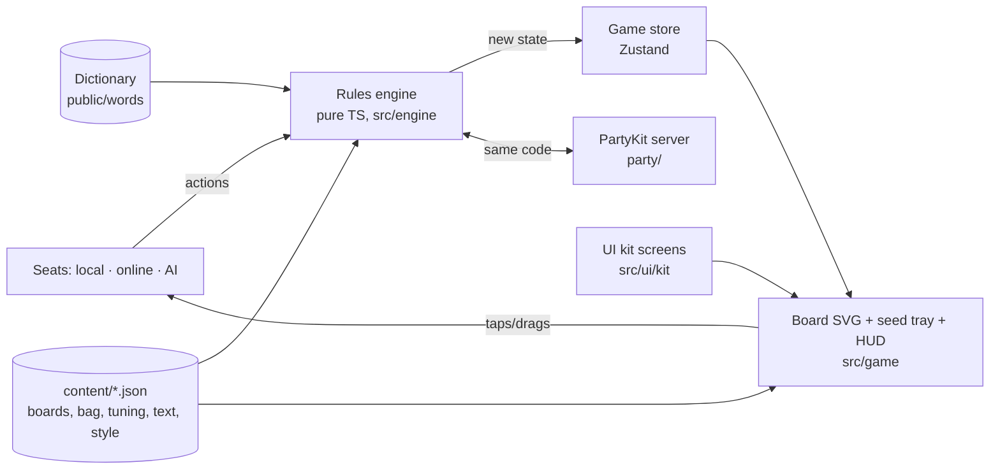

# Glyphtender — Technical Design Document (TDD)

> How the game is built. Plain English first; code names in `backticks` only where they help.
> Living document — /define writes it, /develop keeps it true, /tdd shows it.
> Last updated: 2026-09-30

## 1. At a glance
- **Platforms:** web — phone browsers (portrait + landscape) and desktop. Installable PWA.
- **Stack:** Vite + TypeScript + React, **2D SVG board (no Three.js)**, Zustand for screen state. Why: a flat hex board wants crisp, resizable, tappable shapes — SVG gives that for free, runs cool on phones, and every hex is a real element we can highlight and test.
- **Where it runs online:** GitHub Pages (game) + PartyKit on Cloudflare (online rooms, from alpha's online milestone).
- **Framework modules:** Game UI kit (Cozy, night colours) · Dev Kit · **rooms** (online; harvested from Roll Better during this game) · **ai** (beta; first AI module, built from the original's goal-selection model).
- **Dev Kit tools used:** Console, Tuning, Color (built) — **recommended next:** **Snapshots** (save/restore any board position — the original's pain was edge cases, and a pure-state engine makes this nearly free) and **Bug capture** (last ~60 s of actions → /bug), both framework-first. Later: Multiplayer (online milestone), AI (beta).

## 2. How it fits together

- **Rules engine** (`src/engine/`) — the whole game as pure functions: `applyAction(state, action) → state` plus `legalMoves`, `legalCasts`, `findWords`, `magicFor`, `tangled`. No React, no screen, no network. Seeded random (bag order) so a game can be replayed from its seed + action list.
- **Seats** (`src/seats/`) — who is in each chair. A local seat sends actions from taps; an online seat receives them from the server; an AI seat (beta) computes them. The engine doesn't know which.
- **Game store** (`src/store/`) — current state, the pending (un-cast) move for undo, whose view is showing (pass-and-play), animation queue.
- **View** (`src/game/`) — `Board` (SVG hexes, pieces, highlights, word outlines), `SeedTray`, `TurnBar`, `Handoff`, `Reveal`. Pointer Events; tap-tap and drag share one input hook.
- **Layout shell** (`src/game/layout/`) — chooses **stacked** (tall) or **side tray** (wide) from the *shape of the free space* (aspect ≥ 1.15 → stacked), not the device. Board SVG auto-fits its box; zoom is optional with a Fit button. Sizes in `content/tuning/layout.json`.
- **Menus/HUD** — UI kit screens only (MainMenu, ModeSelect, Settings, Pause, Lobby, Results, toasts). Board, tray and pieces are game components styled only with kit tokens.
- **Online** (`party/server.ts`) — runs the *same engine*; server is the only one who knows the bag and every hand; each player is sent **their own view** (own seeds, others' seed counts, no Magic totals).

**Golden rules**
- The engine never touches the screen or network; the screen never changes game state except by sending an action.
- One engine for client, server, AI and tests — rules are never re-written anywhere else.
- Hidden information stays hidden in the data, not just the display: online views never contain other hands or Magic totals.
- Every tweakable value lives in `content/` — board shapes, bag, hand size, bonuses, timings, layout sizes, colours.
- Every fixed bug gets a test that guards it; every rule in GDD §4 has at least one test.

## 2b. Game-specific systems
**Coordinates** — engine uses **axial hex coordinates** (q, r) — the standard (Red Blob Games) — so leylines are simple steps. Boards are defined in `content/data/boards.json` as column heights (`[4,7,8,9,10,9,10,9,8,7,4]`) like Muzzy's paper notation, converted at load. Designer notation `C4-3` shown in Dev Kit / bug reports.
**Words** — per leyline, collect the run of letters through the new seed; check every sub-run of ≥ min length containing the new seed; keep valid words; drop any word covered by the union of the other kept words on that line (GARDENING/DEN, SEAL+LEAP/ALE). Tested against every example in the digest.
**Dictionary — the official Glyphtender word list** is the original's `words.txt`, **copied byte-for-byte** (blob `3280512a`, identical on the original's main and festive-booth): 63,656 words, 2–15 letters, each with a **Zipf score** (how common it is: THE 7.73 … rare words 0). How it was made: Muzzy chose TWL in the Python prototype (2025-12-14) → 63,612-word list (2025-12-17) → cleaned: abbreviations out, scoring fixes (12-21) → +218 missing words incl. 2-letter words (12-22) → roman numerals out + Zipf column added for AI difficulty (12-23). **Never edit it by hand in code** — it lives in `public/words/words.csv`; changes are deliberate, logged commits. The game uses the words; the **AI uses the Zipf scores** (difficulty + personality vocabulary). Loaded once, async, into a `Map<word, zipf>`; ~250 KB gzipped.
**Multiplayer** (alpha, online milestone) — server-authoritative, same engine. Messages (first draft): `join`, `seat`, `start` → server; `action` (draft / move+cast / refresh) → server validates via engine → `view` to each player; `rejoin`, `leave`, `rematch`. Identity/rejoin/host rules copied from Roll Better (persistentId owns the seat; leave via `useRoom.leave()`). Detail: `design/online.md` when we get there.
**Timers**
| Timer | Length | Owned by | Starts when | On expiry |
|---|---|---|---|---|
| Handoff screen | none (tap to reveal) | client | turn passes to another local seat | — |
| Grow animation | ~0.8 s (`content/tuning/anim.json`) | client | Cast committed | next turn shown |
| Reveal steps | ~0.6 s each, skippable | client | game ends | next step |
| Online AFK | tbd (Roll Better: 2 auto-actions) | server | player's turn starts | alpha: skip/kick · beta: AI takes seat |
| Rematch | 30 s | server | end screen | room closes |

## 3. Data the game reads (editable by Muzzy — in Obsidian or the Dev Kit)
| File | What's in it | Edited with |
|---|---|---|
| `content/data/boards.json` | board shapes (column heights), default board per player count | Obsidian |
| `content/data/bag.json` | seed counts per letter (incl. `Qu`) | Obsidian / Dev Kit → Tuning |
| `content/tuning/rules.json` | hand size 8, min word 2, tangle bonus 3, tangles to end 2, ownership bonus 1 | Dev Kit → Tuning |
| `content/tuning/layout.json` | stacked/side threshold, tray tile size, hex min size, gaps | Dev Kit → Tuning |
| `content/tuning/anim.json` | grow, move, reveal timings | Dev Kit → Tuning |
| `content/ui/style.json` | Cozy preset + night colour tweaks | Dev Kit → Color |
| `content/text/en.json` | every player-facing word ("tangled", "Magic", prompts) | Obsidian |
| `content/credits.json` | fonts, word list | organize-assets |

## 4. Standards
- **Folders:** `src/engine` (rules, pure + tests) · `src/seats` · `src/store` · `src/game` (board, tray, layout) · `src/screens` (kit screens wired up) · `src/ui/kit` (installed, never edited) · `src/devkit` (installed) · `src/devkit-game` (our tabs) · `party/` · `content/` · `public/art` · `sketches/` (prototypes — throwaway) · `e2e/`.
- **Naming:** game words in code match the GDD: `glyphling`, `seed`, `cast`, `magic`, `tangled`, `leyline`. Files `PascalCase.tsx` for components, `camelCase.ts` for logic; JSON keys camelCase.
- **Readable code:** plain names, small files (< ~300 lines), a one-line comment on anything non-obvious. No clever tricks.
- **Tests:** vitest for the engine (every rule, every original bug as a guard) and store; e2e (Playwright, bundled Chromium only) for a scripted full game at 390×844, 844×390, 1440×900. Feel is judged by Muzzy, not tests.
- **Same build everywhere:** CI runs `npm test` + `npm run build` (type check included) before deploying.
- **Branches:** one work branch per delivery (`dev/<milestone>`), merged by /deliver. Tiny fixes on main.
- **Prototypes** live in `sketches/`, reachable at `/glyphtender/sketches/<name>`; their code is not reused unless it's clean — the learnings go into the GDD/TDD.

## 5. Budgets
| | Target | How it's checked |
|---|---|---|
| Frame rate | 60 fps on a mid-range phone during grow animations | Dev Kit → Perf (when built) / DevTools |
| First load | < 3 s on 4G; download < 2 MB incl. dictionary + stand-in art | /deliver quick check |
| Art | runeblossoms + glyphlings ≤ 256 px WebP (originals are 2000 px) | organize-assets |
| AI turn (beta) | < 1 s on a phone, in a Web Worker | timing test |
| Network | 1 action + N views per turn; PartyKit free tier | server logs |

## 6. Security & fairness
- Online: clients only send *intentions*; the server's engine decides. Clients never receive other hands, the bag order or Magic totals — so a cheater can't read them.
- Pass-and-play is on trust (it's one device).
- Dev Kit tools that affect play (Snapshots restore, bag editing) are offline-only.
- No secrets in the repo; `.env` gitignored.

## 7. Compliance & legal (general audience — not made for kids)
- [ ] Privacy policy page (`public/privacy.html`, as Roll Better)
- [ ] App store age rating questionnaire (if stores ever)
- [ ] Data safety / privacy labels (if stores ever)
- [ ] Analytics/ads/accounts → consent (none planned)
- [ ] **Word list licence settled** (see §9 — keep the Zipf pipeline either way) — before 1.0
- [ ] Every font, sound, image licensed (UI kit fonts carry their own credits)
- [ ] Accessibility basics: 18 px text floor, 44 px targets, glyphling colour never the only signal (shape marks in 1.0), reduced motion

## 8. Decisions log
```
D06 · 2026-09-30 · Online hides information in the data, not just on screen
  Proposed by: Claude   Options: send full state, hide in UI / per-player views
  Chose: per-player views — the original's online sent all hands to everyone
D05 · 2026-09-30 · Seats abstraction from day one
  Proposed by: Muzzy ("replace a player with an AI player in the next stage")   Options: hard-code local turns / seats
  Chose: seats — pass-and-play, online and AI all plug into the same chair
D04 · 2026-09-30 · Layout chosen by shape of the free space, not device
  Proposed by: Claude (research: lichess foldable bug)   Options: device breakpoints / aspect ratio
  Chose: aspect ratio ≥ 1.15 → stacked, else side tray; threshold in content/tuning/layout.json
D03 · 2026-09-30 · Axial hex coordinates inside, column notation outside
  Proposed by: Claude   Options: port the original's offset (col,row) / axial
  Chose: axial — leylines become constant steps; boards still authored as Muzzy's column heights
D02 · 2026-09-30 · 2D SVG board, no Three.js
  Proposed by: Claude   Options: SVG / Canvas 2D / R3F 3D
  Chose: SVG — crisp at any size, tappable elements, cheap on phones; 3D figurines stay a Could
D01 · 2026-09-30 · One pure rules engine shared by client, server, AI and tests
  Proposed by: Claude   Options: logic in components (like the original's GameManager) / pure engine
  Chose: pure engine — the original's edge-case bugs came from rules spread across UI code
```

## 9. Third-party stuff
| What | Used for | License | OK for commercial? |
|---|---|---|---|
| Official word list (`words.txt`, built from TWL + Zipf scores) | dictionary + AI vocabulary | TWL is owned by NASPA / Hasbro; Zipf values look like the `wordfreq` library's (its data has its own licence — to check) | ⚠️ fine for a free build. Before 1.0 or any money: ❓ keep and seek permission, or **re-run Muzzy's pipeline on a public-domain base (e.g. ENABLE, very close to TWL)** keeping the Zipf column — the AI tiers depend on Zipf, not on the source list, so that work carries over |
| UI kit fonts (Nunito) | UI | SIL OFL | ✅ |
| React, Vite, Zustand, PartyKit | code | MIT | ✅ |
| Runeblossom + glyphling art | stand-in art | Muzzy's own | ✅ |

## 10. Risks & open questions
- **Board readability on phones** (117 hexes, landscape height ~360 px) → F01 prototype measures it at 3 sizes.
- **Commit style** (undo until Cast) → F01 prototype; Muzzy decides.
- **Word rule edge cases** (union rule) → table-driven tests from every example Muzzy gave.
- **AI speed in a browser** (beta) → Web Worker + timing test.
- **Online secrecy** — per-player views are new vs Roll Better (which showed everything) → design it in `design/online.md` before building.
