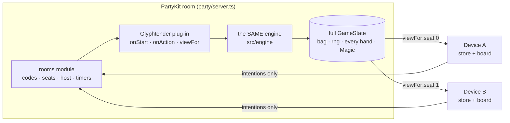

# Glyphtender — Online play (design)
> Detail for GDD §5 Online and TDD §2b Multiplayer — keep in step with both. Written 2026-09-30 (Sprint 05, F19 prep).
> Reference: Roll Better's `design/tech-online.md` + `party/server.ts` (proven rooms, identity, rejoin, host migration, AFK).
> The big difference: Roll Better's phones rolled their own dice and saw everything. Glyphtender has **secret hands and secret Magic**, so the server is in charge of everything and each player only ever receives their own view.

## 1. Who owns what

- **Server-authoritative.** The server makes the game (`newGame` with its own random seed), owns the bag, the rng and every hand, and is the only place `applyAction` changes the real game. Rules are never re-written for the server — it imports `src/engine` (golden rule: one engine everywhere).
- **The server loads the word list itself** (bundled into the server as text, so it never depends on GitHub Pages being up). ~0.9 MB raw / ~250 KB gzipped — check it fits the Workers script limit (see Risks).
- **Clients send intentions** ("move glyphling 2 to C5-3, cast seed 4 at C5-6"). They never apply a real action; they plan, preview and animate on their own copy of their view.

## 2. What each player receives — `viewFor(seat)`
A view is shaped like a `GameState`, so the store, board, previews (`legalMoves`, `previewTurn`) and danger cues work unchanged. What changes:

| Part of the game | Your view | Why |
|---|---|---|
| Board, glyphlings, planted seeds, tangled, whose turn, phase, turn count, draft order | as is | on the table for everyone |
| **Your** hand | your letters | you need them |
| **Other** hands | `'?'` × their count | you may know how many, never which |
| Bag | empty list + `bagCount` | the order is the future — nobody sees it |
| `rng` | 0 | with the rng you could predict every draw |
| `magic`, `tangleMagic`, `winners`, every `magic` inside `lastTurn` | zeroed / empty until game over | Magic is secret until the reveal (GDD rule 11) |
| `lastTurn` (seat, glyphling, from, to, letter, target, words' hexes + spelling, drew) | as is | it's what everyone just watched grow; drives the other seats' animation |

- Your own Cast button still shows "+N" — your device works it out from your hand and the public board (as now).
- **At game over** the server sends `results`: the full final GameState (all hands, all Magic, tangle bonuses, winners) + the end-table stats (`stats.ts`, gathered on the server — D21). Only then can the Magic reveal play.
- The draft needs no hiding (no seeds are dealt until it ends).

## 3. Messages (name → sent by → purpose)
Every message is JSON `{ type, ... }`. Types live in one shared file (`party/protocol.ts`) used by both sides.

**Lobby**
| Name | Sent by | Purpose |
|---|---|---|
| `join { name, persistentId }` | client | enter the room by code; the same persistentId gets its old seat back |
| `ready { ready }` | client | lobby ready toggle |
| `options { players, boardName, minWordLength, turnTimer }` | host | the new-game options (as the new-game screen; `hideSeeds` not needed online) |
| `start` | host | begin; the server checks everyone is ready and 2–4 are seated |
| `lobby { seats, options, host, code }` | server | the lobby as it is now (names, colours, ready, connected) |
| `welcome { seat, persistentId, host }` | server | you're in, this is your seat |
| `error { code, message }` | server | e.g. `room_full`, `not_host`, `bad_options`, `game_running` |

**Game**
| Name | Sent by | Purpose |
|---|---|---|
| `start_game { view, seats, options, version }` | server | the game begins: your view + who sits where |
| `action { action, version }` | client | draft / turn (move + cast) / refresh — an engine `Action`, plus the view version it was planned on |
| `view { view, version, by }` | server | the new state after anyone's action, your view only; `by` = which seat acted |
| `rejected { reason, view, version }` | server | your action was illegal or stale; here is the true view (the store shows the "problem" note and drops the plan) |
| `timer { seat, endsAt }` / `timer { off }` | server | the turn timer for the seat to play (only if the timer is on) |
| `seat_status { seat, status }` | server | `here` · `away` (disconnected) · `auto` (auto-played after missed turns) |
| `results { final, stats }` | server | game over: the whole truth for the reveal + end table |
| `sync` | client | "send me my view again" (after a version gap or a stuck wait) |

**After the game / leaving**
| Name | Sent by | Purpose |
|---|---|---|
| `rematch` | client | vote for Play again; when all connected humans vote (or the host starts) → new game, same seats + options |
| `leave` | client | intentional leave (via `useRoom.leave()`, never a bare socket close — Roll Better's "Don't re-break") |
| `host { seat }` | server | the host changed |
| `room_closed { reason }` / `connected_elsewhere` | server | the room ended / you opened the game in another tab |

## 4. A turn, online
```mermaid
sequenceDiagram
  participant A as Yellow's device (local seat)
  participant S as Server
  participant B as Blue's device
  A->>A: plan move + cast (glide, halo, +N preview) — exactly as pass-and-play
  A->>S: action {turn …, version 12}
  A->>A: Cast: the throw plays at once
  S->>S: right seat? version 12? checkAction → applyAction
  S-->>A: view {v13, by Yellow}
  S-->>B: view {v13, by Yellow}
  A->>A: seed lands → apply v13 (if it arrived; else wait, then sync)
  B->>B: replay lastTurn on the OLD view: glide from→to, throw to target, then apply v13 + sprout
```
- **Your own seat** plans and animates exactly like pass-and-play (the store's `canPlay()` says yes only for your seat). The action is sent the moment you press Cast, so the network round trip hides inside the throw. When the seed lands the store applies the server's view instead of calling the engine. If the view hasn't arrived yet it waits (no spinner for normal lag); after 3 s it sends `sync`.
- **Other seats** (`kind: 'online'`): their `view` arrives with `lastTurn`. The store keeps showing the old view, sets the planned move/cast from `lastTurn` and plays the same story: the glyphling glides (F15 — it only needs "was on A, now on B"), the throw starts after `glideSeconds(from, to)`, lands, then the new view is applied and the runeblossom sprouts. A move-only turn is just the glide.
- **Refresh**: the player who played refreshes on their own device (as now); others only see the hand count change. Draft placements from others simply appear (with a sprout-style pop later, if Muzzy wants).
- **No handoff screen online**: `needsHandoff` only fires between two *local* humans, and each device has one local seat. `hideSeeds` is ignored online.
- **Versions**: every view carries `version` (actions applied so far). Clients ignore older views; a jump of more than one → `sync`. A double-tapped Cast sends the same version twice → the second is `rejected` as stale, harmlessly.

## 5. Seats, identity, reconnect
- **Seats** come from `src/store/seats.ts`: on each device its own seat is `local`, everyone else's is `online` (AI seats in beta are run by the server, and look `online` to devices). One device = one seat in alpha.
- **persistentId** (localStorage) owns the seat; the socket id (per tab) doesn't. Same persistentId in a second tab → the old tab gets `connected_elsewhere` (as Roll Better).
- **Disconnect** → seat status `away`; the seat is held. **Rejoin** with the same persistentId → `welcome` + a fresh `view` (+ `timer` if running); the store loads it like a snapshot (glyphlings glide to where they are now). Late joiners who aren't seated can't join a running game in alpha.
- **Host** only matters in the lobby and for rematch (the server runs the game). If the host leaves or drops, host passes to the next connected human in seat order. No connected humans → the room waits (keepalive), then closes.
- **Leaving for good** (Menu → Leave game): the seat stays in the game and is auto-played (§6) so the others can finish; it can be reclaimed by rejoining.

## 6. Turn timer and AFK
- **Turn timer** (room option, set by the host): off · 60 s · 90 s · 120 s. Default **off** (a cozy word game; friends online) — see Ask Muzzy. It covers the whole turn including the refresh choice.
- **On expiry** the server plays a legal turn for that seat with the engine's sim player (`greedyAction` — a real move, never a pass; the rules say you must move and cast if you can) and counts a **missed turn**. Refresh on expiry = keep all.
- **AFK**: after **2 missed turns in a row** (Roll Better used 2 auto-actions) the seat becomes `auto`: from then on it is auto-played at once each turn. Alpha = the simple sim player; **beta = a real AI personality takes the seat** (GDD beta must). Any real action from the player (rejoin + play) makes it `here` again and resets the count.
- **Timer off + disconnected on your turn**: the server waits a disconnect grace, then treats it as a missed turn (so a vanished player can't freeze the table forever).

**Timers** (TDD §2b format — the TDD table gets these rows)
| Timer | Length | Owned by | Starts when | On expiry |
|---|---|---|---|---|
| Turn timer | off (host: 60 / 90 / 120 s) | server | a seat's turn starts (incl. its refresh) | auto-play a legal turn; +1 missed turn |
| AFK | 2 missed turns in a row | server | first missed turn | seat → `auto` (alpha: sim player · beta: AI) |
| Disconnect grace | 60 s, only on that seat's turn | server | the current seat's socket drops | counts as a missed turn (auto-play) |
| Waiting for my view | 3 s | client | my seed lands before the server's view arrives | send `sync` |
| Empty room keepalive | 5 min (Roll Better: 10 s) | server | the last human disconnects | room closes |
| Rematch | 30 s | server | results sent | room closes if nobody voted |
| Lobby idle | 30 min | server | room created, game not started | room closes |

## 7. The rooms module (framework, branch `dev/rooms`) — what Glyphtender needs from it
**The module provides** (engine-agnostic, harvested from Roll Better): room codes (4 letters, no I/O); join / leave / rejoin with persistentId; duplicate-tab eviction; seats + connected status; lobby ready + host start + host options; host migration; keepalive + room closing; the turn-timer / missed-turn / AFK counting (it calls the game when a seat times out); rematch votes; message envelope, size limit, rate limit, safe JSON parsing; sending each connection its own payload; a client hook (`useRoom`: connect, auto-reconnect with backoff, intentional `leave()`).

**Glyphtender plugs in** (requirements for the module's API):
- `onStart(options, seats) → state` — validate options, make the game with a server-side random seed, deal.
- `onAction(seat, payload) → { state } | { error }` — shape-check the payload, check it's that seat's turn and version, `checkAction`, then `applyAction` (in try/catch — D11).
- `viewFor(seat, state) → payload` — §2. Called for every connection after every change (and on rejoin).
- `currentSeat(state) → seat | null` — whose clock is running (null = nobody, e.g. game over).
- `onTimeout(seat, state) → payload` — the auto-played action (sim player).
- `isOver(state) → results | null` — when set, the module sends `results` to everyone and opens the rematch window.

**Glyphtender-specific** (stays in `party/` + `src/`): the plug-in above, the word list on the server, the view rules, `protocol.ts`, server-side stats, the store's online path (§4), and the Create / Join / Lobby screens (kit parts).

## 8. Security and fair play
- Clients only send intentions; the server's engine decides. A modified client can't see other hands, the bag or Magic — they are **not in the data** (TDD D06), not just hidden on screen.
- Input checks before the engine sees anything: message ≤ 2 KB; `type` is known; hexes are integers on this board; seed index is an integer inside your hand; `setAside` is a list of distinct in-hand indexes; names trimmed to 16 characters, plain text; options from the allowed lists (players 2–4, a board in `boards.json`, minWordLength 2 or 3, a listed timer).
- Only the current seat's action is accepted; stale versions are rejected; everything else is dropped with a log line.
- Rate limit: ~10 messages a second per connection, then dropped (Roll Better learned the hard way that pings need a hard cap — its 45 s unlock limit).
- **Dev Kit online**: tools that change play are offline-only — the adapter's `canRestore` is false when any seat is `online`, and the dev hook's `playRest` / `loadState` jumps do nothing online. Tuning, Colour, Console, Snapshot *capture* and Bug capture still work (they only ever hold your own view).

## 9. Deploy
- `partykit.json`: `{ "name": "glyphtender", "main": "party/server.ts", "compatibilityDate": "2024-12-01", "port": 1997 }` (1997 so it never clashes with Roll Better's 1999 / its e2e 2999).
- `npm run party:dev` runs it on this PC. The game finds it through `VITE_PARTY_HOST`; when that's unset it uses *the same host the page came from* + port 1997, so a phone on Wi-Fi (`npx vite --host`) just works.
- Live: `VITE_PARTY_HOST=glyphtender.<account>.partykit.dev` in the Pages workflow. **The server is deployed separately (`npm run party:deploy`) and ONLY by Muzzy's `/deliver`** — a front-end release does not update the server, and an engine change needs both (the versions must match: the server sends its build version in `welcome`; a mismatch shows "Please refresh").

## 10. Test plan
- **Unit (vitest)**: `viewFor` never contains another hand's letters, the bag, the rng or any Magic before game over — checked over many simulated games (`simulateGame` + a view of every seat after every action). `onAction` rejects: wrong seat, stale version, bad shapes, illegal moves — and the state is unchanged. Timeout → a legal auto-turn; 2 in a row → `auto`.
- **e2e (`npm run e2e:online`)**: its own `partykit dev` + Vite on free ports; two browser contexts create + join by code, ready, start, play a full game with taps (the dev hook's `findCast` is read-only and allowed) through to results + rematch. Every WebSocket frame each page receives is recorded, and the script **fails if any frame ever contains another seat's hand, a bag list, an rng or a Magic number before `results`**. Also: close one context mid-game and reopen it with the same persistentId → same seat, same view; the host leaves → host moves.
- Screenshots of the lobby and an incoming turn mid-glide, both devices.

## Risks
- **Server size**: engine + word list in one Worker — check against the free plan's script limit early (F19 task 4). Fallback: fetch the list once from Pages and cache it.
- **Animation vs arriving views**: another player's view can arrive while you're still watching the previous one — queue incoming turns and play them in order (Roll Better's "deferred snapshot").

## Ask Muzzy:
- **Turn timer default** — off (cozy, friends) or on at 90 s? Which lengths should the host be able to pick?
- **A disconnected player's turn** (timer off) — wait 60 s then auto-play it, or wait longer / let the host choose "skip them"?
- **Leaving mid-game** — the seat is auto-played to the end (proposed), or the game ends for everyone?
- **AFK in alpha** — auto-play the seat with the simple sim player after 2 missed turns (proposed; beta swaps in an AI personality) — is 2 the right number?
- **Two players on one device in an online game** (pass-and-play + online mix) — Won't for alpha?
